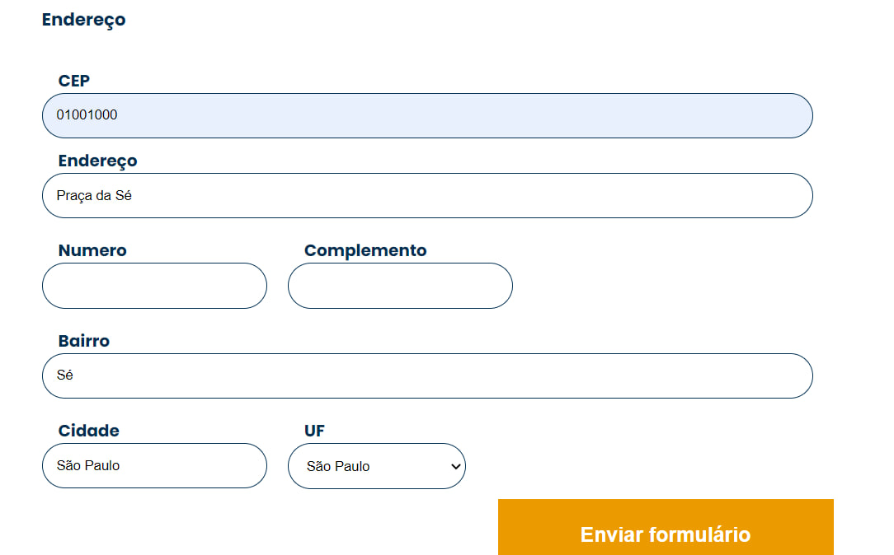

# Consumindo Dados API

 

> Programa Desenvolve e Alura  
O programa desenvolve é um programa gratuito de formação e inclusão de talentos em tecnologia do Grupo Boticário. Em parceria com o Alura Include, as aulas são realizadas online pela plataforma. O curso tem duração de 6 meses e estou participando da trilha de formação Full Stack.

 

## Conteúdo

- [Visão geral](#visão-geral)
  - [Screenshot](#screenshot)
  - [Links](#links)
- [Meu processo](#meu-processo)
  - [Tecnologias usadas](#tecnologias-usadas)
  - [O que aprendi](#o-que-aprendi)
- [Créditos](#créditos)

## Visão geral

### Screenshot

### Links
 - Site URL: [Vá para o site](https://santosfer.github.io/js-consumindo-dados-api/)

 ## Meu processo

 ### Tecnologias usadas

 - Javascript;
 - HTML5

 ### O que aprendi

Nesse projeto utilizamos a API ViaCEP para quando o usuário digitar CEP no campo pedido, ele ja preencha os campos de nome da rua, bairro, cidade e estado. Foi possível entender como funciona as funções assincronas e colocar em prática através de dois métodos: 

> then()

e, também:

> asynch e await

após "pegar" o CEP, foi utilizado o getElementById e o inner.HTML para pegar os id's no html e imprimir na tela, nos seus respectivos campos, as informações de rua, cidade, etc. Também foi tratado erro, para imprimir na tela quando o CEP for digitado incorretamente ou não existir.

 ## Créditos

 Curso realizado pela Alura. 💙 Pela instrutora [Monica Hillman](https://github.com/MonicaHillman/js-consumindo-dados-api).
